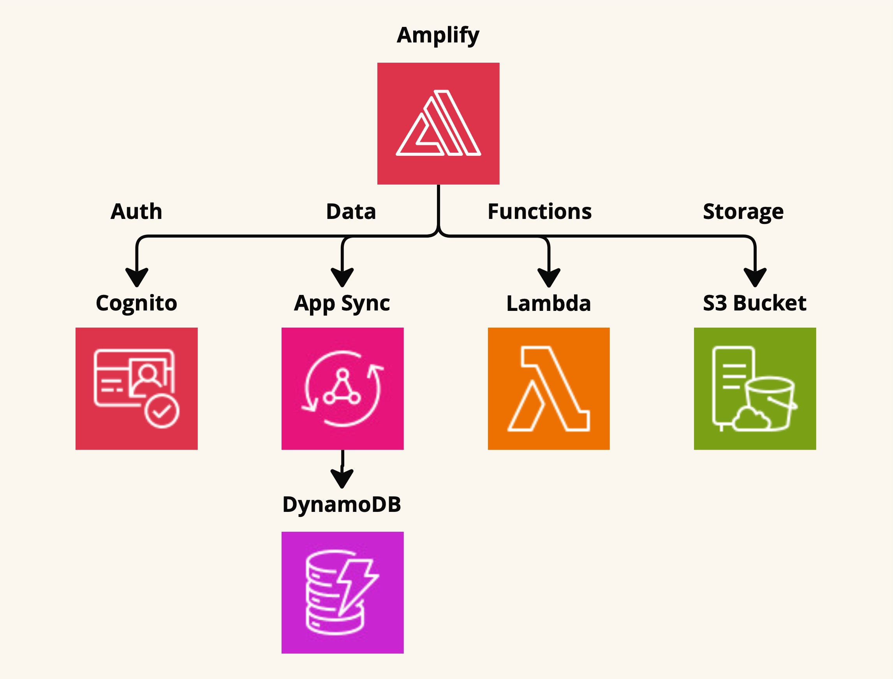
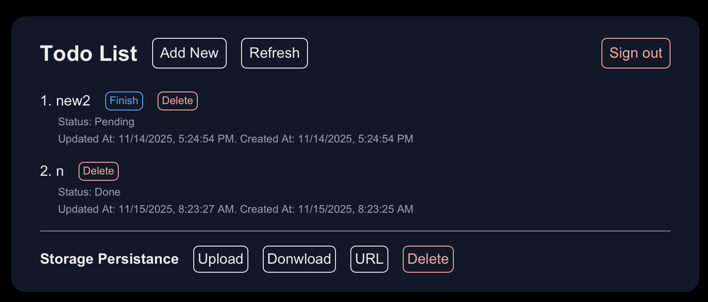

# Amplify + NextJs Demo

A demo of using Amplify with Next js to create a simple Todo list. For more details, please refer to my article [AWS Amplify Gen.2 For Web App In Super Detail](https://medium.com/@itsuki.enjoy/aws-amplify-gen-2-for-web-app-in-super-detail-b91d8cabadb5?postPublishedType=initial).

Specifically, this demo includes demonstration on using the basic building blocks Amplify provides.

- Authenticate user with Cognito
- Implement data models with Dynamo DB and App Sync
    - perform data operation from frontend
    - subscribe to real-time database update
- Custom Functions with Lambda
    - invoke function as query from frontend
- Manage file-like resources with S3 bucket as storage
    - upload, download, obtain presigned url, delete file from frontend

In addition, it also includes some code for adding custom resources or modifying resources above with CDK. Such as
- add Cognito user pool domain and managed login branding to Cognito user pool
- Create API Gateway RestAPI
- Configure custom lambda triggers such as SQS and S3 events

# Deploy
1. Run `npm install` to install the necessary dependencies.
2. Run `npx ampx sandbox --once` to deploy the resource and create an amplify sandbox

# Clean up
1. Run `npx ampx sandbox delete` to delete the resource as well as the sandbox.
